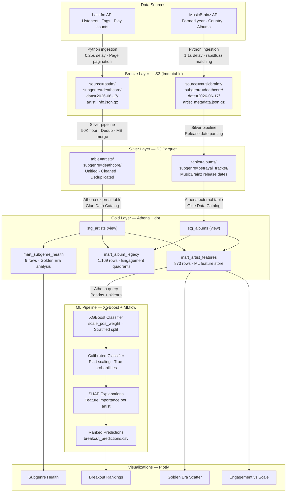

# Metal Music Intelligence Pipeline


A production-grade batch ELT pipeline and ML system that ingests data from Last.fm and MusicBrainz, transforms it through a medallion architecture on AWS, and predicts which underground metal bands are about to break out.

**Three analytical pillars:**
- **Golden Era** — which formation decade produced each subgenre's biggest bands
- **Engagement vs Scale** — loyal deep fans vs casual broad reach across 870+ artists
- **Breakout Predictor** — XGBoost classifier (ROC-AUC 0.980) ranking underground bands by breakout probability

---

## Architecture



---

## Key Findings

**`plays_per_listener` is the strongest breakout signal (SHAP 3.11)**
A band with 50K fans who each play them 100 times is a stronger breakout candidate than one with 200K fans who play them 5 times. Loyal deep listeners signal genuine cultural resonance.

**Metalcore and Nu-Metal dominate by total listeners — but progressive metal has the highest breakout rate**
Subgenres formed in the 1990s-2000s produce the most breakout artists proportionally, even though newer subgenres like djent have more active artists.

**Top breakout candidates (underground, < 200K listeners):**

| Rank | Artist | Subgenre | Listeners | Breakout Probability |
|------|--------|----------|-----------|----------------------|
| 1 | Frontside | Metalcore | 70,448 | 66.3% |
| 2 | Stam1na | Progressive Metal | 136,473 | 66.1% |
| 3 | Callejon | Metalcore | 81,272 | 44.5% |
| 4 | Invent Animate | Metalcore | 134,525 | 26.0% |
| 5 | Bal-Sagoth | Symphonic Metal | 78,427 | 25.7% |

---

## Tech Stack

| Layer | Tools |
|-------|-------|
| Ingestion | Python 3.12, uv, Last.fm API, MusicBrainz API |
| Storage | AWS S3, Parquet + Snappy, gzip JSON |
| Transformation | dbt Core, AWS Athena, AWS Glue |
| ML | XGBoost, scikit-learn, SHAP, MLflow |
| Visualization | Plotly |
| Infrastructure | AWS IAM, boto3 |

---

## Project Structure

```
metal-intelligence/
├── ingestion/
│   ├── lastfm/          # Artist info, tags, weekly charts
│   ├── musicbrainz/     # Formed year, country, album dates
│   └── spotify/         # Dead code - kept as documentation of API restrictions
├── silver/
│   ├── cleaning/        # Bronze reader, type casting, deduplication
│   ├── pipeline.py      # Bronze -> Silver orchestration
│   └── writer.py        # Parquet writer (PyArrow + Snappy)
├── dbt/
│   └── metal_intelligence/
│       └── models/
│           ├── staging/ # Views: stg_artists, stg_albums
│           └── marts/   # Tables: subgenre_health, album_legacy, artist_features
├── ml/
│   ├── data.py          # Athena loader, feature engineering, train/test split
│   ├── train.py         # XGBoost + calibration + MLflow
│   └── predict.py       # Inference, ranked output, SHAP per artist
├── visualizations/
│   └── charts.py        # Four Plotly charts -> HTML
├── scripts/
│   ├── setup_athena.py  # Creates Glue database + external tables
│   └── export_marts.py  # Exports Gold marts to CSV
└── interview_study_guide.md
```

---

## Running the Pipeline

### Setup

```bash
# Install dependencies
uv sync

# Configure environment
cp .env.example .env
# Fill in: LASTFM_API_KEY, AWS_ACCESS_KEY_ID, AWS_SECRET_ACCESS_KEY,
#          S3_BUCKET_NAME, AWS_REGION, ATHENA_S3_OUTPUT
```

### 1. Bronze ingestion

```bash
# Last.fm - all subgenres
uv run python -m ingestion.lastfm.ingest --all

# MusicBrainz - artist metadata
uv run python -m ingestion.musicbrainz.ingest --all

# MusicBrainz - album release dates
uv run python -m ingestion.musicbrainz.ingest --albums
```

### 2. Silver cleaning

```bash
uv run python -m silver.pipeline --all
uv run python -m silver.pipeline --albums
```

### 3. Athena setup + dbt

```bash
# Create Glue database and external tables
uv run python -m scripts.setup_athena

# Build Gold marts
cd dbt/metal_intelligence
uv run dbt run --profiles-dir ..
uv run dbt test --profiles-dir ..
```

### 4. ML pipeline

```bash
# Start MLflow server
mlflow server --host 127.0.0.1 --port 5000 --workers 1

# Train and log model
uv run python -m ml.train

# Generate ranked predictions
uv run python -m ml.predict
```

### 5. Visualizations

```bash
uv run python -m scripts.export_marts
uv run python -m visualizations.charts
# Open visualizations/output/*.html in browser
```

---

## Design Decisions

**Why Last.fm over Spotify for genre classification?**
Last.fm's community tag system covers niche subgenres like deathcore. Spotify's taxonomy returned 400 for `genre:deathcore`. Last.fm has thousands of fans who tagged these artists — that is ground truth.

**Why Parquet in Silver?**
Columnar storage means Athena reads only queried columns. Snappy compression reduces file size. Schema enforcement eliminates string/int ambiguity from raw JSON.

**Why stratified random split instead of temporal?**
The dataset is a cross-sectional snapshot — every feature is current state. There is no time axis to leak across. Temporal split on `formed_year` produced a degenerate test set with zero breakout artists (bands formed post-2005 haven't had enough time to reach 1M listeners).

**Why exclude the 200K-1M listener range from ML training?**
Artists in this range are ambiguous — slowly breaking out, peaked early, or mid-tier permanently. Training on ambiguous labels adds noise. The rejection region ensures only clearly-labeled examples enter training.

**Why Platt calibration on top of XGBoost?**
XGBoost's `predict_proba` gives a discrimination score, not a true probability. Calibration makes the scores interpretable — a 0.66 probability means 66% chance of breaking out, not just "more likely than 0.5".

---

## Data Quality Notes

- **50K listener floor** applied in Silver, not Bronze — threshold can be changed without re-calling APIs
- **Entity resolution** uses rapidfuzz token_sort_ratio: auto-accept >= 90, review 70-89, reject < 70
- **MusicBrainz merge** only on `auto_accepted` matches — null is better than wrong data
- **Spotify removed** mid-project after November 2024 API restrictions eliminated audio features, popularity, and follower counts under client credentials
- **Last.fm tagging artifacts** — community tags occasionally include non-metal artists; filtered in visualization layer
